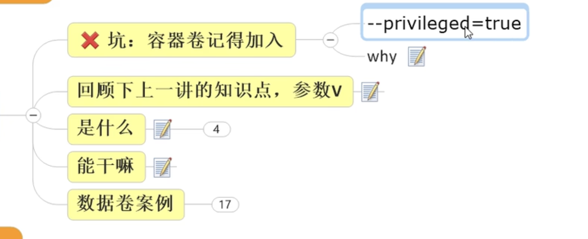
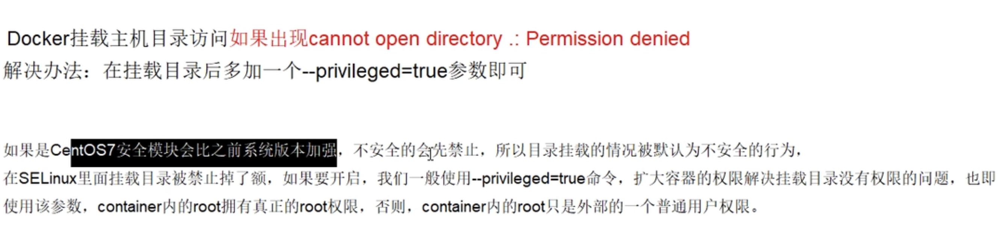

## 容器卷是什么

其中 -v 就代表要添加一个容器数据卷 v : volume

`docker run -it --previleged=true -v <container-dest-dir>:<host-source-dir> <image-name>`

完成容器目录到主机目录的映射：
通过这样的方式就可以在容器内通过访问 `<container-dest-dir>` 来访问主机的` `host-source-dir` 目录了

## 容器卷能干什么

1. 建立容器路径到宿主机路径的映射

   如果宿主机中没有该路径，那么会自动创建该路径
   docker run -it --previleged=true -v <container-dest-dir>:<host-source-dir> <image-name>

