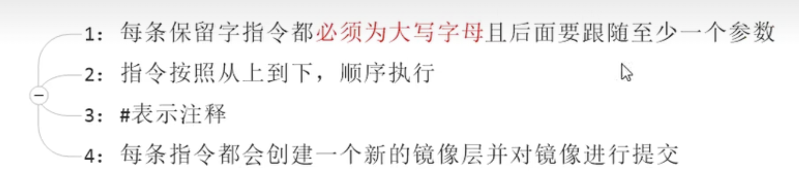

## Docker File 简介

DockerFile 是用来构建 Docker 镜像的文本文件，是由一条条构建镜像所需的指令所构成的脚本文件


## Docker File 构建过程解析

基础;



docker 执行 docker file 的过程：


## Docker File 保留字指令


1. FROM : 当前构建的镜像基于哪一个镜像进行构建

2. MAINTAINER : 维护者，可以留下作者的名字和邮箱

3. RUN : 容器构建时需要执行的命令，有 shell 和 exec 两种格式，在 docker build 时运行
   `RUN <command>` 这里的 `<command>` 是 shell 命令，等同于在终端操纵容器的 shell 命令
   `RUN ['exec_file_path', 'arg_1', 'arg_2', 'arg_3']` 等价于 `RUN exec_file_path arg_1 arg_2 arg_3`

4. EXPOSE port ， 当前容器对外暴露的端口 port 

5. WORKDIR ：在容器创建后，登录容器的默认登录路径

6. USER : 指定该镜像以什么用户去执行，默认为 root 用户 

7. ENV：用来在构建镜像过程当中设置环境变量，如 `ENV MY_PATH /usr/mytest` ，就可以在后续的 RUN 或者 WORKDIR 等指令中使用该环境变量 如 `$MY_PATH`

8. ADD：ADD = COPY + 解压 ； 将宿主机中的文件拷贝进镜像，并且会自动处理 URL 和解压 tar 压缩包

9. COPY：
   

10. VOLUME：容器卷

11. CMD：

    指定容器启动后要做的事情

    Dockerfile 中可以有多个 CMD 指令，但是只有最后一个 CMD 指令才会执行 并且 CMD 会被 docker run 后的参数替换，这个参数就是指 docker run 后边接着的容器启动后运行的命令 

     参考官网 tomcat 的 Dockerfile :
    `EXPOSE 8080`
    `CMD ['catalina.sh', 'run']`

    如 ： `docker run -it <image-id> /bin/bash` 这样就不会执行 CMD 后的命令了

    如 ： `docker run -it <image-id>` 这样才会执行 CMD 后的命令

    

12. ENTRYPOINT：
    
    

docker hub 官网 ：
`https://hub.docker.com/_/tomcat`


## ENTRYPOINT


在表格中的第二列 **按照 dockerfile 编写执行** 属于没有在命令行传递参数的情况，这时候会应用 dockerfile 中的 CMD 里边的内容作为 ENTRYPOINT 的参数

表格中的第三列 **传参运行** 这里传递了 -c 的参数 `/etc/nginx/new.conf` 会覆盖 CMD 里边的内容，也就是说 CMD 里边的内容不起效果了，被取代了


## 案例 - 自定义镜像 ubuntu java 8

要求：让该镜像具备 vim 、ifconfig 、jdk8

教程中使用的是 centos 的最小镜像来完成的，因为 centos 已经没有官方源了，所以使用了 ubuntu 镜像来实验


构建 `docker build -t <new-image-name>:TAG .` 会自动读取当前目录下的 Dockerfile 文件

运行 `docker run -it <new-image-name>:TAG /bin/bash`

dockerfile:

```
FROM ubuntu
ENV MYPATH /usr/local
WORKDIR $MYPATH

RUN apt -y update
RUN apt -y upgrade

# 安装 vim 编辑器
RUN apt -y install vim

# 安装 ifconfig
RUN apt -y install net-tools

# 安装 lib 库
RUN apt -y install gcc

# 安装 java8 ; ADD 命令有自动解压的功能
RUN mkdir /usr/local/java
ADD ./Downloads/jdk-18_linux-aarch64_bin.tar.gz /usr/local/java

# 配置 Java 环境变量
ENV JAVA_HOME /usr/local/java/jdk-18.0.2.1
ENV JRE_HOME $JAVA_HOME/jre
ENV CLASSPATH $JAVA_HOME/lib/dt.jar:$JAVA_HOME/lib/tools.jar:$JRE_HOME/lib:$CLASSPATH
ENV PATH $JAVA_HOME/bin:$PATH

EXPOSE 80


CMD echo $MYPATH
CMD echo "success ..............."
CMD /bin/bash
```


## 虚悬镜像

产生 REPO 或者 TAG 的内容为 `<none>` 的叫做虚悬镜像

出现上述的原因是在构建镜像的过程中出现了错误

`docker image prune`  会移除所有的虚悬镜像


