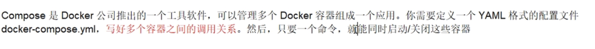
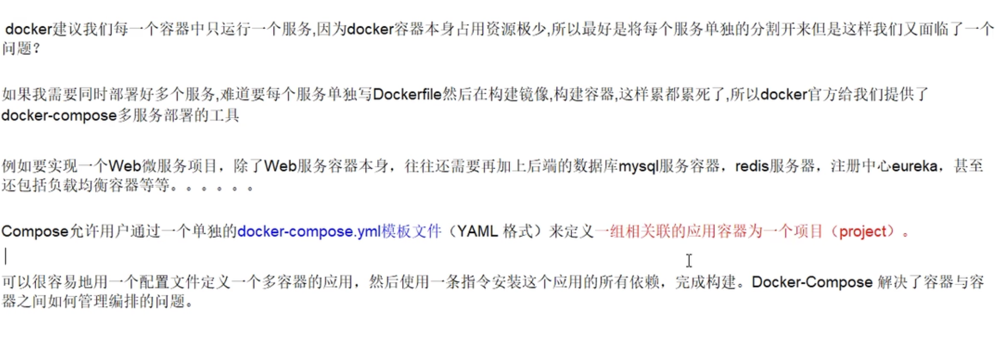
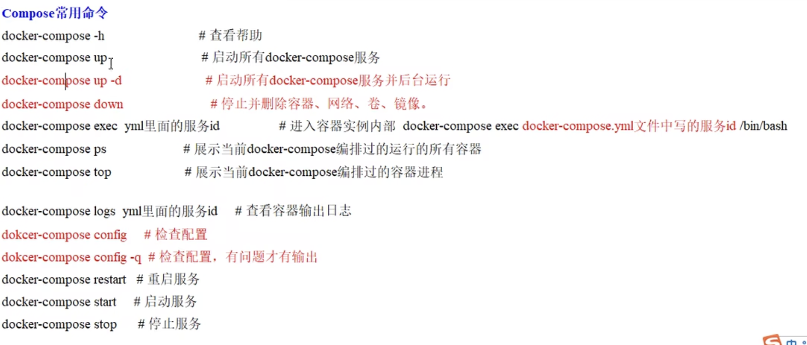
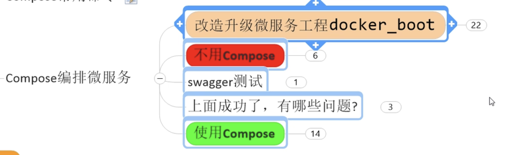

## 78-80 Docker Compose

容器编排

## 安装

https://docs.docker.com/compose/install/

https://docs.docker.com/compose/install/compose-plugin/

## compose 核心概念

文件：docker-compose.yml

两要素：

1. 服务：一个应用的容器实力
2. 工程：一组相互关联的容器组成的一个完整的业务单元，在 docker-compose.yml 中定义

## Compose 常用命令

## 不使用 Compose 微服务编排

跳过了这部分内容

## Compose 微服务编排

步骤：

1. 写 docker-compose.yml 文件
2. `docker-compose up -d` 后台执行所有 docker-compose 服务

